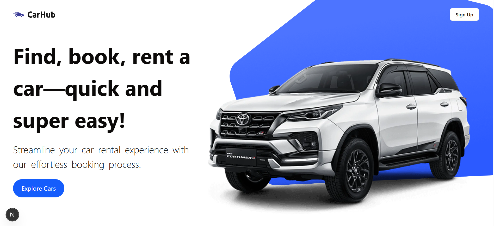
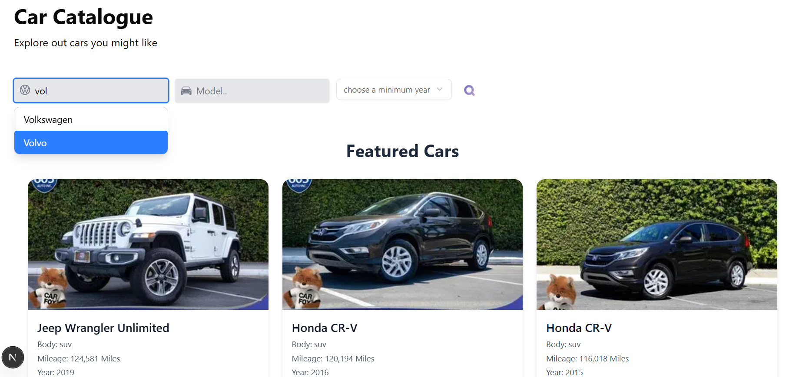
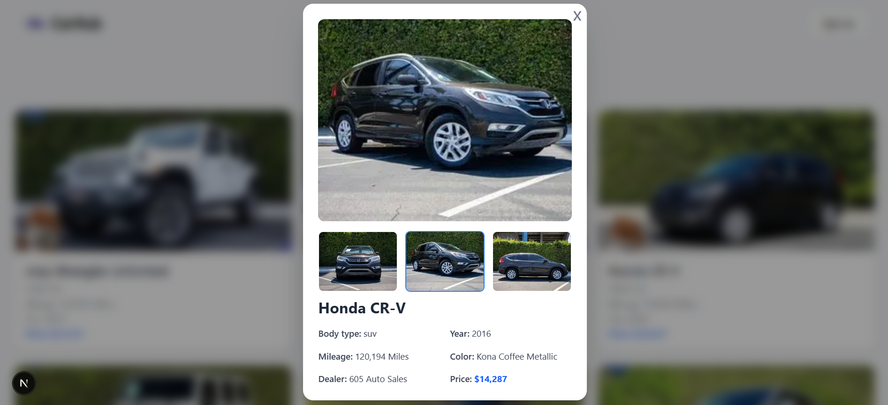
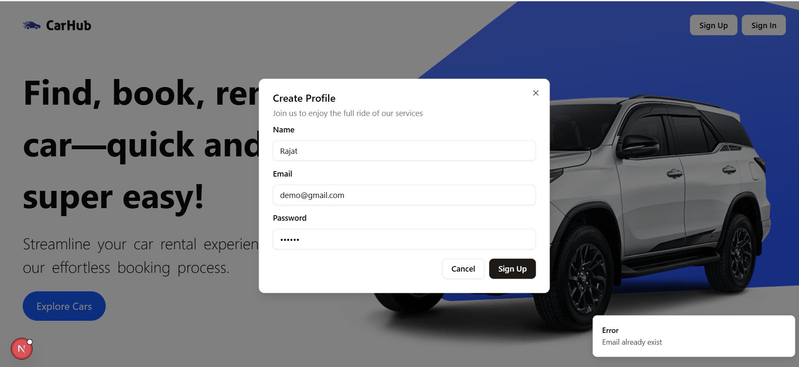
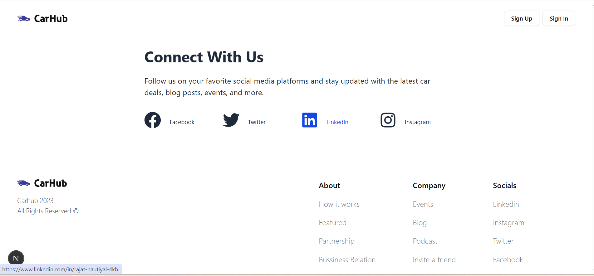

# CarHub 🚗

This is a [Next.js](https://nextjs.org) project bootstrapped with [`create-next-app`](https://nextjs.org/docs/app/api-reference/cli/create-next-app).

---

## 🚀 Tech Stack

- [Next.js](https://nextjs.org)
- [Tailwind CSS](https://tailwindcss.com)
- [ShadCN UI](https://ui.shadcn.com/)
- [Mongoose](https://mongoosejs.com/)
- [JWT (JSON Web Tokens)](https://jwt.io)

---

## 🛠️ Getting Started

First, run the development server:

```bash
npm run dev
# or
yarn dev
# or
pnpm dev
# or
bun dev

---









